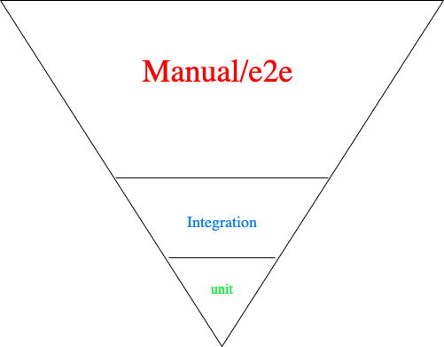
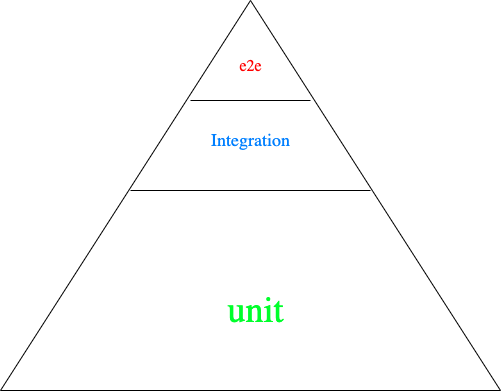

TDD, BDD in Javascript World
===

The benefits of applying test-driven development (TDD) methodologies in our every day are huge:

- Tested code, great coverage
- Modular and loosely coupled code
- Great relation and understanding between customer - PM - developer
- [40% - 80% fewer bugs](https://www.researchgate.net/publication/3249271_Guest_Editors'_Introduction_TDD--The_Art_of_Fearless_Programming) in production
- Can save development time with some experience

TDD stands for Test Driven Development and the process consist on:
- Write a test and watch it fail
- Implement minimal expression of code to make it pass
- Refactor both test and code if needed

TDD saves everybody in your team a lot of time. Putting in place some continuous integration and deployment (CI/CD) will make sure that every change have to pass all other tests in the codebase before merging them. 

> You will loose the "fear of change"

If we complement TDD with Behavior driven development (BDD), then we can go home knowing we are doing the good thing.

> I like to sleep good at night, that is why I TDD and BDD

TDD process is more focused in unit testing while BDD (branch of TDD) is more focused on producing integration tests with a concept we call "black box testing".

# Pyramid of testing

The problem I see that a lot of companies have is the "inverted pyramid of testing". Firstly, it is not cost effective.
<table>
  <tbody>
    <tr>
      <td align="center" valign="top">
        
        <br>
        <p>Manual testing is very expensive</p>
      </td>
      <td align="center" valign="top">
        
        <br>
        <p>Unit tests should form the base amount of tests in your project</p>
      </td>
     </tr>
  </tbody>
</table>

I call it "the inverted pyramid" and it does not stand still for so long since manual testing is very inefficient and expensive. The more you go to the top the more expensive it is. The point here is not about replacing every manual test and say good bye to the QA team, no, I love my QA team mates! the point here is starting to take responsibility of what you create, what you code. Manual testing is still important, like exploratory testing and other forms, but we have to reduce the impact/cost of manual testing as much as we can. How? automating tests by adopting the BDD process.


Two obstacles that we are going to combat in the series:
- laziness
- inexperience

You will become a better developer, your team mates will love your contributions and your customers will be in the same page as you are on what features have to be delivered.

The series consists on applying BDD, TDD workflow in
- a Node JS environment where we will create an express app with a declarative and functional style.
- A front-end environment where we will create a React app with the help of browser automation.

# Why

As I always say to my team mates, 

> let's do what we have to do to sleep better at night

The above is just a consequence of feeling responsible for what we code. To have a safety net of tests always enhances confidence reducing the "merge fear" or "fear of change" when it comes to adding new features or refactoring.

# But we don't have time to do TDD

It is just a misconception that TDD slows down the delivery model. Normally an unexperienced developer would spend more time on the process because firstly, one needs to learn how to do things and adapt. Also it requires discipline.

> A mentor can break the mental barrier that most of newcomers have.

It is really normal to try adopting TDD and quit 5 minutes later, it feels boring and developers get discouraged if they don't know what to test, where to put the focus on or how to do it. As I commented in the "backend series" you need to first understand patterns and some models that work better with TDD. now would be a good time to revisit them. The process will help you understand them and also will improve your application architecture.

Experienced developers will experiment an increase in speed when implementing new features and don't get me started with the amount of future bugs that using the technique avoids!

> TDD is actually the fastest and more secure way to get features out there

# What about Legacy code

You have a customer, they hired another company months ago to build them software, they didn't do TDD and they have a big problem. Hold on to your seat!

Nobody wants to admit that they have legacy code. The cadence was feature-based and now it is full of spaghetti code with innumerable “if else” (branching) statements everywhere. Now it is really difficult to do or refactor something without breaking other logic.

> But they promised us they will refactor the code

We have to be very careful at this point because usually the same developer that did not test its code is not going to test it “before starting the refactor process“. 

# How to apply TDD to legacy code?

You cannot, TDD is a process to build code, but if you want to start a process of refactoring so you can apply TDD afterwards, we can start with something.

We can start creating integration tests focusing on the functionality of the application/system. This approach would be called “black box testing”, it means that we don’t need to care about implementation details. 

Nice right? 

It makes sense since what we have is something we don’t understand at a lower level. Using Gherkin and cucumber you can create a nice “feature” suite or even getting some coverage with POSTMAN if we are talking about back-end. That should be enough.

When we finish writing those integration tests, we can approach a refactor, isolating different parts.

If you can rewrite the feature it would be a nice time to set up an “assert” library of your choice. In javascript ecosystem we have lots of options. If we do that we can start a rewrite with TDD, writing the test first, watch it fail, implement the minimal expression of the assertion, seeing it pass, and refactor if needed both code and test. It is a discipline.

But sometimes we don’t know where to start. This is my suggestion:

- Choose the simplest library like "tape"
- Start testing

# Start testing

Don't bother about TDD now. It is really important that you get used to test your craft. You will find obstacles, that's for sure:

- How can mock this and that?
- How can I set and remove the state before and after the tests

I have been there. They are all code smells.

> Separate your side effects from your pure functions

TDD and unit testing work better with pure functions

> A pure function will produce always the same output when receiving the same input

Understanding this separation of concerns will lead you to better architectures.

I use BDD in my process, integration tests that cover those parts and side effects that I should not test with unit tests.

# Know your tools

Know your tools, your unit test framework, or even try find different patterns that are going to help you implement features with TDD, does not matter if your doing the test after implementing the code (for now), but start testing now. You need to “fail fast” to understand the “why” of some concepts.

Usually when you build a codebase with TDD, if you do it right, you find out that the separation of concerns happens naturally:
- the business logic or how data is processed is in one place
- network layer (http clients)
- database connections
- logging tools
- other side effects

I actually would not mind having this tree in my app

```
app
├── pure-code
└── side-effects
```

Clear right?

# Program to interfaces, not implementations

That means that TDD enforces you to focus first on how would you like to use the functionality.

In my mind I think first about declarative ways to use methods
```js
composeName('Alan', 'Smith')
```

knowing the signature of the function helps in composing the assertion. 

```
composeName :: (String, String) -> String
```

At some point you will have to import the module to test the method. What that module exposes is its API, and an API is nothing more than an interface. As you will see your architecture will get simpler and extendable.

> Focus on the user, focus on the interface

# Back-end - Node JS


- [Preparation and mental models](docs/b.part1.md)
- [BDD, TDD Framework set up](docs/b.part2.md)
- [Writing features with Cucumber, BDD](docs/b.part3.md)
- [Writing code with TDD](docs/b.part4.md)
- [Refactoring and some notes](docs/b.part5.md)

# Front-end - React

- [Preparation and mental models](docs)
