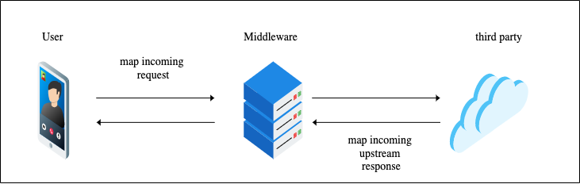

TDD, BDD in Node JS - Part Four
===

In part three we got our first feature and implemented its steps in cucumber. We did everything using TDD as part of our BDD process.

In part four we will try to apply TDD to produce our production code. 

What you will learn:
- Use of cucumber hooks to prepare the environment
- Spawn processes in Node JS
- Use of BDD and TDD as a workflow
- Functional patterns
- The "wrong first approach"

# Start stubs with cucumber hooks

First, let's analyze the feature we got.

```gherkin
Feature: Stores
  As a consumer of the API,
  I want to be able to perform CRUD operations on stores endpoints

  Scenario: Successfully get a list of stores near me
    Given request headers
      | content-type | application/json |
    When I make a "GET" request to "stores"
    Then I receive a 200 status code response
    And every element on "body" property has "interface"
      | metadata | object |
      | data     | array  |
    And "body.data" property has more than 1 element
    And every element on "body.data" property has "interface"
      | type        | string |
      | description | string |
      | location    | string |
      | distance    | number |
    And every element on "body.data" property has "restrictions"
      | property | operator  | value |
      | distance | less than | 200   |
```

First thing that we should do is create a server. That server has to have an endpoint called `/stores` that accepts `GET` requests.

app/server.js
```js
const express = require('express')
const app = express()
const port = process.env.PORT || 3000

app.get('/stores', (req, res) => res.json({ name: 'hello world' }))
app.listen(port, () => console.log(`app magic happens on port ${port}`))

```

Now we need to start this server automatically whenever we execute our integration test. We will use cucumber hooks for that. It is also important to kill every process that we started after all test are executed. We will use another hook to do that. Follow along with me in the next piece of code

hooks.js
```js
const { BeforeAll, AfterAll } = require('cucumber')
const spawn = require('child_process').spawn
const path = require('path')
const processes = []

BeforeAll(async function () {
  /* start up any process before running any test */
  processes.push(await runServer('app'))
})

/* kill every process that we started after all tests are executed */
AfterAll(async () => Promise.all(processes.map(process => killProcess(process))))

function runServer (name) {

  /* we can aggregate any processes that we want to spawn to the available table */
  const available = {
    app: {
      command: 'node',
      args: [path.resolve(__dirname, '../../../app/server.js')],
      regex: /app magic happens on port/
    }
  }
  const server = available[name]
  return new Promise((resolve, reject) => {
    const ps = spawn(server.command, server.args)
    ps.stdout.on('data', processOutput => {
      /* 
      When the process we just spawned generates output data, we are going to
      read it and resolve the promise when matches the process regex. This is a
      way to know when our process is up. For our case it will mean that our server
      is prepared to receive requests
       */
      const output = processOutput.toString()
      server.regex.test(output) && resolve({ ps, name })
    })
  })
}

function killProcess (child) {
  return new Promise((resolve) => {
    child.ps.kill()
    child.ps.on('exit', (code, signal) => {
      console.log('\nprocess terminated:', child.name)
      resolve(code)
    })
  })
}
```

As you can see, integration tests requires a little bit more of preparation. But why? Think about what integration means, we are not testing atomic parts of our program, we are going out of that loop and testing the interconnection between larger pieces. Sounds scary, but the rewards are high. You can now present this tests to the customer to sign off when the feature is completed. See it as proof, as acceptance criteria.

Well, if you were able to correctly start and halt the server using the hooks, you should see something like this:


We can see that the first assertion (status code) passed, but the second about validating the interface of the response crashed. And that is totally fine, our server is returning a hello world message for now!

Now it is time to start implementing the endpoint. Here is an idea with the nice pipe pattern I mentioned in part one.

```js
app.get('/stores', (req, res) => {
  const responseBody = pipe(
    composeRequest
    makeRequest,
    composeResponse
  )(req.body)

  res.json(responseBody)
})
```

I always start writing how I would like to use an API, it is really important to stay declarative in this part. This particular endpoint is serving as a middleware that will call a third party API (or more in the future) and will process the response from the upstream to return a formatted one to the final user.



```js
    /* 
    Map incoming body to what we need to make the request
    to the third party
    */
    composeRequest 
    makeRequest,
    /* Map upstream's response to what we are returning to the user*/
    composeResponse
```


# Creating the pipe function
I recommend to use the pipe function from a library that had tested the function already, but for the sake of clarity, let's write ourselves:

tools.test.js
```js
const test = require('tape')

test('pipe', function ({ deepEqual, end }) {
  const identity = value => value
  const actual = pipe(identity)(1)
  const expected = 1
  const msg = 'passing just identity should return unmodified value'
  deepEqual(actual, expected, msg)
  end()
})
```

Test will fail, let's satisfy the first assertion

tools.js
```js
module.exports = {
  pipe
}

function pipe (fn) {
  return value => fn(value)
}
```
and the signature is 

`pipe :: fn -> number -> number`

Higher order functions, fancy stuff? maybe, but very powerful.

it reads: 

> `pipe takes a function and returns another function that takes a number and returns a number` 


But the real pipe does not have that signature! imagine that we could only use pipe passing only one function. What a waste!

tools.test.js
```js
  {
    const actual = pipe(identity, identity, identity)(1)
    const expected = 1
    const msg = 'passing identity n times should return unmodified value'
    deepEqual(actual, expected, msg)
  }
```
This test will pass, but it is a false positive because pipe is only executing the first identity function. You have to be aware of this kind of FALSE POSITIVES when you TDD functions.

```js
function pipe (...fns) {
  return input => fns.reduce((previousOutput, fn) => fn(previousOutput), input)
}
```
So with pipe, it is just a matter of iterating through the functions we pass and keep applying the output to the current function that the previous functions produced. The signature for our pipe:

`pipe :: ([any -> any]) -> any -> any`

We could keep adding tests:

```js
  {
    const actual = pipe(addTwo, identity, multiplyByThree)(1)
    const expected = 9
    const msg = 'passing functions that do simple math operations'
    deepEqual(actual, expected, msg)
  }
    {
    const actual = pipe(addTwo, identity, multiplyByThree)(1)
    const expected = multiplyByThree(identity(addTwo(1)))
    const msg = 'functions passed should be able to be composed and produce same output'
    deepEqual(actual, expected, msg)
  }
  ...
```
There are some rules that pipe should comply with, like composition.

Try to figure out with testing first how to design the async version of pipe. What would be the signature now for pipe? would it change at all?

Well, here you have some help. This would be async pipe:

```js
function pipe (...fns) {
  return input => fns.reduce(async (previousOutput, fn) => fn(await previousOutput), input)
}
```
`pipe :: [Any -> Any] -> Any -> Promise`

That means that every step function has to still comply with `same input, same output` BUT those values can be wrapped in a Promise object. This is interesting because pipe will unwrap and wrap those values without you even noticing. It is also more flexible, because now we can mix sync and async functions:

```js
pipe(
value => value, // Identity
value => Promise.resolve(value), // Promise wrapped identity
value -> 2 * value, // multiplyBy2
async value => 2 * value // asyncMultiplyBy2
)(1) // 4
```

Wanted to know what a monad is, there you go! now we have a system that wraps and unwraps values, map over values, flexible and composable. A Promise looks already like a monadic value, and it also has a `then` method that looks really similar to a `map` method if you think about it.

# Use pipe in the middleware code

our middleware now looks like this:

```js
const express = require('express')
const bodyParser = require('body-parser')
const {pipe} = require('./tools')
const app = express()
const port = process.env.PORT || 3000

app.use(bodyParser.json())
app.get('/stores', (req, res) => {
  const responseBody = pipe(
    composeRequest // sync method
    makeRequest, // async method
    composeResponse // sync method
  )()
  res.json(responseBody)
})

app.listen(port, () => console.log(`app magic happens on port ${port}`))

```

We imported `pipe` and `bodyParser` just to have easier access to the body of incoming POST, PUT... . 

Let's modify `pipe`'s input and create a structure like this:

```js
pipe(
  ...
)({
  event: {
    body: req.body 
  },
  data: { config },
  result: {}
})
```

even better, create a factory function:

```js
pipe(
  ...
)(lift(req.body))

function lift(config = {}, body = {}) {
  return {event: {body}, data: {config}, result: {}}
}
```

Two things here:

- The name `lift` is just a fancy functional way to call this function, but in fact, we are kind of "lifting" the type here to a type structure that we are going to maintain all along the pipe flow. We will refer to the structure that we just created as "lifted type" or "payload"
- We did not start with a test because there is no need to test a simple factory function. Trying to achieve 100% coverage is just not focusing where you need to focus.

We can move now the `lift` function to `tools.js`

I know it looks like a lot of preparation, but look at our first `/stores` endpoint, it is looking good and loosely coupled, structured and composable.

# TDD composeRequest

```js
app.get('/stores', (req, res) => {
  const responseBody = pipe(
    composeRequest,
    makeRequest,
    composeResponse
  )(lift(config))
```

tools.test.js
```js
...
test('composeRequest() should compose request options so they can be consumed by the GOT http customer module ', async function ({ deepEqual, end }) {
  const config = {
    endpoint: 'foo',
    host: 'http://localhost:3333',
    method: 'GET',
    headers: { 'content-type': 'application/json' }
  }
  // composeRequest :: Payload -> Payload
  const actual = composeRequest(lift(config))
  const expected = {
    event: { body: {} },
    data: {
      config,
      request: {
        uri: new URL('foo', 'http://localhost:3333'),
        options: {
          method: 'GET',
          headers: { 'content-type': 'application/json' }
        }
      }
    },
    result: {}
  }
  deepEqual(actual, expected)
  end()
})
```
`composeRequest` is a function that will create the options to be used by the next step to make the request. Its signature accepts the type `Payload` and should return the type `Payload` because every step function has to comply with that rule.

Watch the test fail, then implement

```js
function composeRequest (payload) {
  const config = payload.data.config
  const endpoint = config.endpoint
  const base = config.host
  const headers = config.headers
  const method = config.method

  const requestOptions = {
    uri: new URL(endpoint, base),
    options: {
      headers,
      method
    }
  }

  payload.data.request = requestOptions
  return payload
}
```

The test will pass, but there are some things that we can improve:

- traversing properties with lodash get
- setting properties with lodash set
- clone deep the payload whenever we expect to mutate it to avoid side-effects
- abstract setters and getters and create simpler functions

Ok, but how can we make sure there are no mutations when we test? 

> deep freezing my friend.

```
$ npm i -S lodash.get lodash.set lodash.clonedeep
$ npm i -D deep-freeze
```

tools.test.js
```js
test('composeRequest() should compose request options so they can be consumed by the GOT http customer module ', async function ({ deepEqual, end }) {
  const config = {
    endpoint: 'foo',
    host: 'http://localhost:3333',
    method: 'GET',
    headers: { 'content-type': 'application/json' }
  }
  // composeRequest :: Payload -> Payload
  const actual = composeRequest(deepFreeze(lift(config)))
  const expected = {
    event: { body: {} },
    data: {
      config,
      request: {
        uri: new URL('foo', 'http://localhost:3333'),
        options: {
          method: 'GET',
          headers: { 'content-type': 'application/json' }
        }
      }
    },
    result: {}
  }
  deepEqual(actual, expected)
  end()
})
```

And the test will fail now. Fix the function to pass the test

tools.js
```js
function composeRequest (payload) {
  const newPayload = cloneDeep(payload)
  const { host, headers, method, endpoint } = get(payload, 'data.config', {})

  const requestOptions = {
    uri: new URL(endpoint, host),
    options: {
      headers,
      method
    }
  }
  return set(newPayload, 'data.request', requestOptions)
}
```

I always recommend the use of deep freezing your objects in your tests to make sure the functions are not producing undesirable side effects.

> Can you see the amount of bugs that we are avoiding already with TDD?

# TDD makeRequest ?

I wouldn't TDD this function because it is a side effect, that is why we have to rely on our BDD test to cover this functionality. Also, this is a library we are using that it is already heavily tested, so we don't want to reinvent the wheel. This is why choosing the right library is very important and the advantage of the JS and node community.

network.js
```js
const get = require('lodash.get')
const set = require('lodash.set')
const cloneDeep = require('lodash.clonedeep')
const got = require('got')

module.exports = {
  makeRequest
}

async function makeRequest (payload) {
  const newPayload = cloneDeep(payload)
  const { uri, options } = get(newPayload, 'data.request')

  const response = await got(uri, options).json()
  return set(newPayload, 'data.response.body', response)
}
```

Now it is a good idea to crete a sandbox/stub for the third party that we will start automatically every time we execute our integration tests.

We can use express here to create a stub

test/mocks/stub.js
```js
const express = require('express')
const bodyParser = require('body-parser')
const app = express()
const port = process.env.PORT || 3010

app.use(bodyParser.json())
app.get('/data', (req, res) => {
  const data = [
    {
      type: 'store',
      class: 'dog',
      report: 'Nice dog store in downtown Toronto',
      address: '203 King street West',
      range: 100
    },
    {
      type: 'store',
      class: 'cat',
      report: 'Nice cat store in downtown Toronto',
      address: '200 Wellington street West',
      range: 50
    },
    {
      type: 'store',
      class: 'dog',
      report: 'Nice alternative dog store in downtown Toronto',
      address: '203 King street West',
      range: 220
    },
    {
      type: 'store',
      class: 'barber shop',
      report: 'Nice barber shop downtown Toronto',
      address: '20 King street West',
      range: 10
    }
  ]
  res.json(data)
})

app.listen(port, () => console.log(`stub magic happens on port ${port}`))
```

The data we are responding with it is data that matches the third party structures. Our job after we request the data is to filter, map it and return it to the costumer if needed. First, remember that we have to start this stub in cucumber hooks in the same way we start our middleware.

# TDD mapResponse

At this point our endpoint should look like this:

```js
app.get('/stores', async (req, res) => {
  const config = {
    host: 'http://localhost:3010',
    endpoint: 'data',
    method: 'GET',
    headers: { 'content-type': 'application/json' }
  }
  const responseBody = await pipe(
    composeRequest,
    makeRequest,
    mapResponse
  )(lift(config))
  res.json(responseBody)
})
```

Our next task should be designing `mapResponse` in a way that with just providing a "contract" with this structure

```js
contract: {
      x: 'a',
      y: 'b'
    }
```

and a response of this type

```js
{
  a: 1,
  b: 2
}
```

the result would be 

```js
{
  x: 1,
  y: 2
}
```

It should be easy right? there is a package we can install to map keys:

`$ npm i -S lodash.mapkeys`

And our test approach:

```js
test('mapResponse() should map a given body response to the structure desired', async function ({ deepEqual, end }) {
  const payload = {
    data: {
      response: {
        body: [
          { a: 1, b: 2 },
          { a: 3, b: 4 },
          { a: 5, b: 6 }
        ]
      }
    }
  }
  const actual = mapResponse(payload)
  const expected = {
    data: {
      mappedResponse: {
        body: [
          { x: 1, y: 2 },
          { x: 3, y: 4 },
          { x: 5, y: 6 }
        ]
      },
      response: {
        body: [
          { a: 1, b: 2 },
          { a: 3, b: 4 },
          { a: 5, b: 6 }
        ]
      }
    }
  }
  deepEqual(actual, expected, 'map every element of the array to given interface')
  end()
})
```

Notice that when doing TDD you are always in the trenches, having to decide wether your API provides one contract or another. For `mapResponse` you can see that we decided to use it as a step in the pipe function and now it has to ingest the whole payload to do a simple mapping. We can feel that maybe it is not aiming in the right direction. In part 5 we will learn how we can create proper functional abstractions to improve our aiming.

We decided with the test that mapResponse is gonna have to do the following:
- get the contract from a fixed path
- get the response from a fixed path
- iterate over the response if it is an array
- map over every key according to the contract

Lot of stuff right. It looks like this function is doing a lot of stuff. That is why we should split the problem.

let's create our mapKeys function:

```js
test('mapKeysWith() should map the keys of input object according to a template or contract', async function ({ deepEqual, end }) {
  const data = { a: 1, b: 2 }
  const contract = { x: 'a', y: 'b' }
  const actual = mapKeysWith(data, contract)
  const expected = { x: 1, y: 2 }
  deepEqual(actual, expected, 'keys exist and they do not have null or undefined values')
  end()
})
```

This test looks more cut to chase of the problem. We will comment or skip the `mapResponse` test for now, as it looks more like an integration.

```js
function mapKeysWith (data, contract) {
  return mapKeys(data, function (value, key) {
    // get contract key and substitute
  })
}
```

There is a nice function that we could is from lodash called `invert` that would be a perfect fit. Our contract has a structure that the user understands `x, y` but for the substitution it would be nicer if we have a better way to access the props.

`npm i -S lodash.invert`

```js
function mapKeysWith (data, contract) {
  const contractProps = invert(contract)
  return mapKeys(data, function (value, key) {
    return contractProps[key]
  })
}
```

Now you have the opportunity to implement other cases. What will happen if input data has null, undefined values. What happens if the contract expects to have some properties in the input, but they are not there? You have to decide the way this function handle those things. It is your turn!

# Back to mapResponse

This is how the test should look like:

```js
test('mapResponse() should map a given body response to the structure desired', async function ({ deepEqual, end }) {
  const payload = {
    data: {
      config: {
        contract: { x: 'a', y: 'b' }
      },
      response: {
        body: [
          { a: 1, b: 2 },
          { a: 3, b: 4 },
          { a: 5, b: 6 }
        ]
      }
    }
  }
  const actual = mapResponse(deepFreeze(payload))
  const expected = {
    data: {
      config: {
        contract: { x: 'a', y: 'b' }
      },
      mappedResponse: [
        { x: 1, y: 2 },
        { x: 3, y: 4 },
        { x: 5, y: 6 }
      ],
      response: {
        body: [
          { a: 1, b: 2 },
          { a: 3, b: 4 },
          { a: 5, b: 6 }
        ]
      }
    }
  }
  deepEqual(actual, expected, 'map every element of the array to given interface')
  end()
})
```

Looks neat, but it is a bit of a pain passing large structures to test this function. As I mentioned before, part 5 will focus on different mental models and abstractions to improve our solutions with smart refactoring. Hang in there, we are making a lot of progress!

Let's update our pipe function with our mapResponse component

```js
  const responseBody = await pipe(
    composeRequest,
    makeRequest,
    mapResponse
  )(lift(config))
```

But `mapResponse` is returning the entire payload. We need another step that creates the result with this structure:

```js
{
  data,
  metadata
}
```

```js
test('createResult() should produce a formatted structure to use as response', async function ({ deepEqual, end }) {
  const payload = {
    data: {
      mappedResponse: [
        { x: 1, y: 2 },
        { x: 3, y: 4 },
        { x: 5, y: 6 }
      ],
      response: {
        body: [
          { a: 1, b: 2 },
          { a: 3, b: 4 },
          { a: 5, b: 6 }
        ]
      }
    }
  }
  const actual = createResult(deepFreeze(payload))
  const expected = {
    data: {
      mappedResponse: [
        { x: 1, y: 2 },
        { x: 3, y: 4 },
        { x: 5, y: 6 }
      ],
      response: {
        body: [
          { a: 1, b: 2 },
          { a: 3, b: 4 },
          { a: 5, b: 6 }
        ]
      }
    },
    result: {
      data: [
        { x: 1, y: 2 },
        { x: 3, y: 4 },
        { x: 5, y: 6 }
      ],
      metadata: {}
    }
  }
  deepEqual(actual, expected, 'copy mappedResponse to result field and apply contract')
  end()
})
```

As you can see this looks more like an integration test. Our functions might be doing more than one thing at time. For now it is a decision we made, so let's proceed with the implementation for that.


```js
function createResult (payload) {
  const newPayload = cloneDeep(payload)
  const data = get(newPayload, 'data.mappedResponse')
  const result = {
    data,
    metadata: {}
  }
  return set(newPayload, 'result', result)
}
```

Really easy implementation. As for now, you should have noticed that we are repeating some patterns here. What would be your ideas to refactor?

# Sending back a proper response

Our endpoint should look like this

```js
app.get('/stores', async (req, res) => {
  const config = {
    host: 'http://localhost:3010',
    endpoint: 'data',
    method: 'GET',
    headers: { 'content-type': 'application/json' },
    contract: {
      type: 'class',
      description: 'report',
      location: 'address',
      distance: 'range'
    }
  }
  const { result } = await pipe(
    composeRequest,
    makeRequest,
    mapResponse,
    createResult
  )(lift(config))

  res.json(result)
})
```

The configuration looks good. We provided the correct request info and also the contract that will work as an adapter or model to map the response we will receive from the third party.

Take a look at the BDD test output


Amazing, three assertions are passing, but there is some failure in the assertion that checks the structure of every element in `body.data`, we can log the output and start debugging.

ok, there is a problem in our mapping. Each element is mapped to this structure.

```js
    {
      undefined: 'store',
      type: 'dog',
      description: 'Nice alternative dog store in downtown Toronto',
      location: '203 King street West',
      distance: 220
    },
```
The element comes like this from the third party

```js
    {
      type: 'store',
      class: 'dog',
      report: 'Nice alternative dog store in downtown Toronto',
      address: '203 King street West',
      range: 220
    },
```
our contract looks like this:

```js
    contract: {
      type: 'class',
      description: 'report',
      location: 'address',
      distance: 'range'
    }
```

Well, we did not want to use `type` property from the 3d party because it was repetitive. This means that we have a bug. The mapper is not skipping properties that does not exist in our contract.

# One bug?, one test

This is rule of thumb. if you find a bug, you need a test.

```js
test('mapResponse() should map a given body response to the structure desired', async function ({ deepEqual, end }) {
  const payload = {
    data: {
      config: {
        contract: { x: 'a', y: 'b' }
      },
      response: {
        body: [
          { a: 1, b: 2 },
          { a: 3, b: 4 },
          { a: 5, b: 6 },
          { a: 7, b: 8, c: 9 } // add something that we don't want to use
        ]
      }
    }
  }
  const actual = mapResponse(deepFreeze(payload))
  const expected = {
    data: {
      config: {
        contract: { x: 'a', y: 'b' }
      },
      mappedResponse: [
        { x: 1, y: 2 },
        { x: 3, y: 4 },
        { x: 5, y: 6 },
        { x: 7, y: 8 } // should fail for now
      ],
      response: {
        body: [
          { a: 1, b: 2 },
          { a: 3, b: 4 },
          { a: 5, b: 6 },
          { a: 7, b: 8, c: 9 } // response is not mutated
        ]
      }
    }
  }
  deepEqual(actual, expected, 'map only the elements according to give interface')
  end()
})
```

Now it is time for you to implement the solution. If you are creating semantic commits you could write something like

`fix: remove undefined property generated in mapKeys` 

- function fixed in related file
- test case added for the fix

> Always add tests to your fix commits

Once fixed, our BDD test has one last reason to fail


Check the response body once again, we are not filtering stores that are farther than 200. That is why the assertion is failing.

OK, a filter step is needed.

# Filters

I have an idea, since we are using a config object for that specific endpoint, we could add something like this that could work perfectly with our solution

```js
  const config = {
    host: 'http://localhost:3010',
    endpoint: 'data',
    method: 'GET',
    headers: { 'content-type': 'application/json' },
    contract: {
      type: 'class',
      description: 'report',
      location: 'address',
      distance: 'range'
    },
    filters: [
      (element) => element.distance < 200
    ]
  }
  const { result } = await pipe(
    composeRequest,
    makeRequest,
    mapResponse,
    filterResponse,
    createResult
  )(lift(config))
```

And start with a test for the `filterResponse` function.

```js
test('filterResponse() should apply filters specified in config object to mappedResponse', async function ({ deepEqual, end }) {
  const payload = {
    data: {
      config: {
        filters: [
          (element) => element.x < 4
        ]
      },
      mappedResponse: [
        { x: 1, y: 2 },
        { x: 3, y: 4 },
        { x: 5, y: 6 }
      ]
    }
  }
  const result = filterResponse(deepFreeze(payload))
  const actual = result.data.mappedResponse
  const expected = [
    { x: 1, y: 2 },
    { x: 3, y: 4 }
  ]
  deepEqual(actual, expected)
  end()
})
```

Watch the test fail, then implement the solution so it satisfies the assertion.

```js
function filterResponse (payload) {
  const newPayload = cloneDeep(payload)
  const data = get(newPayload, 'data.mappedResponse', [])
  const filters = get(newPayload, 'data.config.filters', [])
  const filtered = data.filter(element => filters.every(filter => filter(element)))
  return set(newPayload, 'data.mappedResponse', filtered)
}
```

Once the unit test pass, let's see what is going on in our BDD test


# Summary

We implemented our production code using TDD with the focus on making the BDD test pass. We had to make decisions on the way about how particular modules will be consumed. Also TDD and functional programming made us structure our code in a loosely couple manner. We have unit tests and integration tests covering our first feature.

Go on a see part 5 where we will refactor and throw some ideas and mental models.